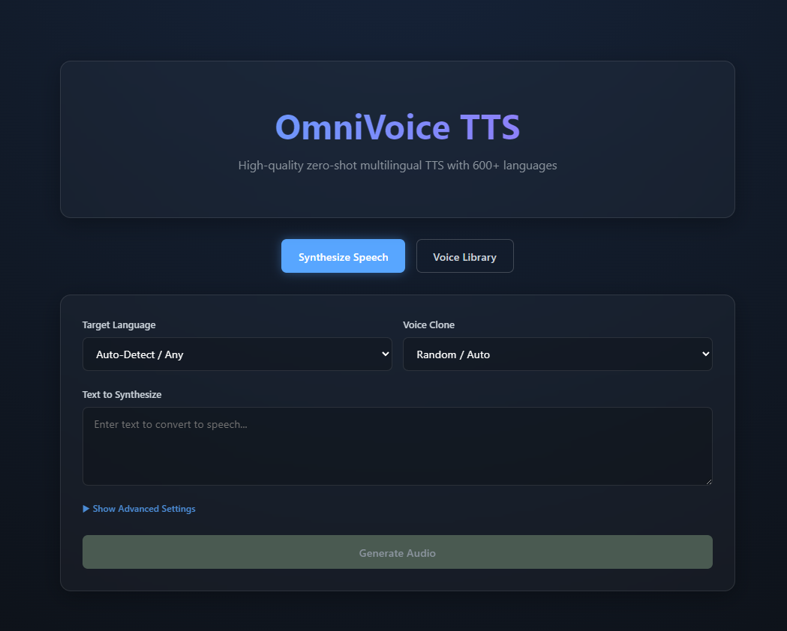

# OmniVoice TTS API

This is a standalone Text-to-Speech API built with **FastAPI**, based on the powerful [OmniVoice](https://github.com/k2-fsa/OmniVoice) engine. It provides a simple REST interface for high-quality, multilingual voice cloning and synthesis.



## Credits
This project is based on the original [OmniVoice](https://github.com/k2-fsa/OmniVoice) repository by k2-fsa. All credits for the core model architecture and training go to the original authors.

## License
Distributed under the **Apache 2.0 License**. See `LICENSE` for more information.

## Support the Developer
If you find this project useful, consider supporting me on Ko-fi:
[](https://ko-fi.com/megaaziib)

---

## Installation & Setup

### 1. API Setup (using `uv`)

This project uses [uv](https://github.com/astral-sh/uv) for fast and reliable Python package management. You **must** have `uv` installed to run the backend.

1. **Install uv**:
   Follow the instructions at [astral.sh/uv](https://astral.sh/uv) to install it on your system.

2. **Setup Environment**:
   In the root directory of this repository, run:
   ```bash
   uv sync
   ```
   This will create a virtual environment and install all necessary dependencies (including torch, fastapi, etc.).

3. **Run the API**:
   You can use the provided batch file (Windows) or run manually:
   ```bash
   # Using the batch file
   run_api.bat

   # Manual run
   uv run uvicorn api:app --host 0.0.0.0 --port 8000 --reload
   ```

### 2. Frontend Setup (using `npm`)

The frontend is built with React and Vite.

1. **Navigate to frontend folder**:
   ```bash
   cd frontend
   ```

2. **Install dependencies**:
   ```bash
   npm install
   ```

3. **Run the frontend**:
   ```bash
   npm run dev
   ```
   The frontend will typically be available at `http://localhost:5173`.

---

## API Documentation
Once the API is running, you can access the interactive Swagger documentation at:
- `http://localhost:8000/docs`

For a detailed breakdown of endpoints, see [API_DOCS.md](API_DOCS.md).

## Features
- **Zero-Shot Voice Cloning**: Clone any voice with just a few seconds of reference audio.
- **Multilingual Support**: Supports high-quality synthesis for English, Chinese, Japanese, Korean, and Indonesian.
- **FastAPI Backend**: High-performance, asynchronous API.
- **Modern UI**: Clean and responsive web interface for easy testing.
